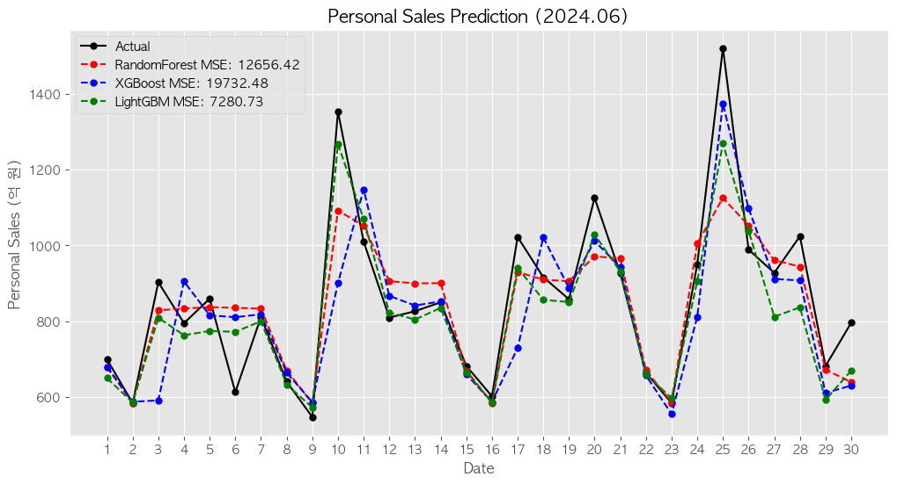

# 앙상블 모형 기반 신용카드 일별 매출 예측

> 실제 업무에서 다뤘던 카드 매출 예측 문제를 공개 데이터로 재현한 Replication 프로젝트입니다.



## Summary

- **목표**: 서울 지역 신용카드 일별 개인 매출을 예측하고, 월간 목표 관리에 쓸 수 있는 누적 오차를 함께 평가합니다.
- **데이터**: 금융데이터거래소의 `NH농협카드 일자별 소비현황_서울` 월별 CSV를 사용합니다.
- **모델**: RandomForest, XGBoost, LightGBM을 비교합니다.
- **검증 방식**: Time Window Expanding CV로 모델을 평가하고, 2020~2023 전체 데이터로 최종 학습 후 `2024년 1월`을 타겟 기간으로 평가합니다.
- **결과**: **RandomForest**가 CV와 최종 테스트 모두에서 일관되게 가장 우수한 성능을 보였습니다.
- **비즈니스 해석**: MSE와 함께 월 누적 예측 오차를 계산해 "목표 대비 몇 억 원 차이인지" 설명합니다.

## Repository Structure

```text
.
├── README.md
├── requirements.txt
├── sales_prediction.py
├── sales_prediction.ipynb
└── images/
    ├── fig1.png   # 2024년 1월 예측 결과
    ├── fig2.png   # EDA (결측치 / 상관관계)
    ├── fig3.png   # 이상치 탐지
    ├── fig4.png   # 요일별 / 월별 매출 패턴
    ├── fig5.png   # Expanding CV Fold별 MSE 추이
    └── fig6.png   # 피처 중요도 (LightGBM)
```

`sales_prediction.ipynb`는 분석 과정과 시각화를 보여주는 노트북이고, `sales_prediction.py`는 동일한 코드를 스크립트 형태로 실행할 수 있는 파일입니다.

## Data

데이터는 라이선스와 오너십 문제로 저장소에 포함하지 않습니다. 아래 링크에서 월별 CSV를 내려받은 뒤 `data/` 폴더에 넣어 실행합니다.

- 데이터 출처: [금융데이터거래소 - NH농협카드 일자별 소비현황](https://www.findatamall.or.kr/market/dataProdList?prodCd=GENERAL&menuNo=28)
- 사용 기간: `2020-01`부터 `2024-01`
- 파일명 형식: `[NH농협카드] 일자별 소비현황_서울_YYYYMM.csv`
- 주요 컬럼: `승인일자`, `이용건수_개인`, `이용금액_개인`, `이용건수_법인`, `이용금액_법인`

일부 CSV는 `utf-8-sig`, `euc-kr`, `cp949` 인코딩이 섞여 있을 수 있습니다. 코드는 세 인코딩을 순차적으로 시도해 로딩합니다.

## Setup

```bash
conda create -n credit-card-sales python=3.10
conda activate credit-card-sales
pip install -r requirements.txt
```

이미 분석용 conda 환경을 사용하고 있다면 해당 환경을 활성화한 뒤 `pip install -r requirements.txt`만 실행해도 됩니다.

## Modeling

타겟은 `이용금액_개인_억원`입니다.

- 피처: `승인일자`, `year`, `month`, `day`, `dayofweek`
- 검증: Time Window Expanding Cross Validation (2020-01 ~ 2023-12, 47 folds)
- 최종 학습 구간: `2020-01-01` ~ `2023-12-31`
- 타겟 평가 구간: `2024-01-01` ~ `2024-01-31`

## Evaluation

모델은 두 관점으로 평가합니다.

| 관점 | 지표 | 의미 |
| --- | --- | --- |
| 일별 예측 정확도 | MSE, MAE, MAPE | 하루 단위 예측값이 실제값에 얼마나 가까운지 |
| 월간 목표 관리 | 누적 예측 오차, 누적 오차율 | 한 달 합계 기준으로 몇 억 원을 과대/과소 예측했는지 |

**RandomForest**가 CV와 최종 테스트(2024년 1월) 모두에서 일관되게 낮은 오차를 기록해 최종 모델로 선정되었습니다.

## Assumptions and Risks

- 데이터 파일명이 `_YYYYMM.csv`로 끝나지 않으면 로딩 대상에서 제외됩니다.
- 데이터 컬럼명이 바뀌면 피처 생성 단계가 실패합니다.
- LightGBM은 운영체제나 Python 버전에 따라 설치 이슈가 날 수 있습니다.
